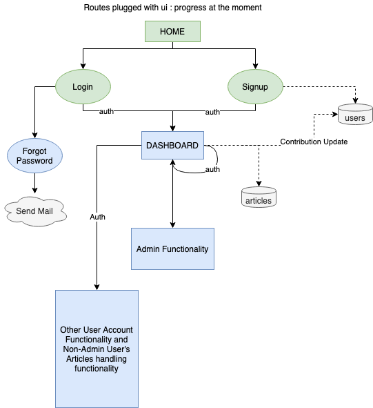

# The Weekly Edge Application

This repository is for development of TWE Web Application for The Hindu Education Plus Club. 

## Flow

Progress tested with basic ui for now

## Progress

1. Routes for basic user operations set up - Login, Register, Signup, Update, Delete, logout, logout everywhere, forgot password.
2. Routes for handling articles set up - create, update, list by id, list all, delete
3. basic frontend with hbs dynamic rendering
4. validation using validator during db storage
5. auth middleware - checks for jwt token during login/signup and stored browser cookie.
6. picture upload for each article

## API Routes - For Frontend Developers

Request Body or Request Query or Request Params are Null unless stated otherwise

All Responses are in Status Codes and JSON

### User Routes: *api/users/*

1. Create User - POST *api/users/signup*
   1. Request Body: JSON with name,email,password,department
   2. On Success: 200, {created User,token}
   3. On failiure: 400

2. Login User - POST *api/users/login*
   1. Request Body: email,password
   2. On Success: 200, {user,token}
   3. On post failure: 400

3. Logout User - POST *api/users/logout* & Logout from everywhere *api/users/logoutAll*
   1. On success: 200
   2. Request Header - "Authorization" - with Bearer token recieved (referred from here on as **AUTH HEADER**)
   3. Auth Failiure: 401
   4. On post Failiure: 500

4. Get Dashboard *api/users/dashboard*, Login *api/users/login*, Signup *api/users/signup*
   1. Give back 200 - Render from react

5. Fetch User Name by ID - GET */api/users/name/:id*
   1. No Auth
   2. Success - 200, user's name as *string* (not object)
   3. Failiure - 400 /(If not found 404)

6. Update User - PATCH *api/users/me*
   1. Request Body: JSON with keys as valid fields that can be changed (name, email,password,age,department)
   2. Auth Header - 401 on Failiure
   3. On Success: 200, updated user
   4. On Failiure (patch or invalid update): 400

7. Delete User - DELETE *api/users/me*
   1. Auth Header - 401 on Failiure
   2. On Success: 200
   3. On delete Failiure: 500

8. Read User - GET *api/users/me*
   1. Auth Header - 401 on Failure
   2. On success - 200, UserObject of the jwt token
   3. On failure - 404

9.  Read Contributions of all users - GET *api/users/me/contribution*
   4. Auth Header - 401 on Failure
   5. On Success - 200, List of objects with id,name and contribution field objects - (that in turn has myTotalContribution,myTotalNewsContibution,mySatireNewsContibution,myTotalFactsContibution,myEditorialNewsContibution)
   6. On Failure - 404

### Article Routes: *api/articles/*

1. Create Article - POST *api/articles*
   1. Request Body: JSON with atype,atitle,acontent,picture(picture is *type: file*) -- UPDATE: Picture Upload Disabled for Now
   2. Auth Header (Here checks author also - only author can see their articles)
   3. On success: 200, created article
   4. On post Failiure: 500

2. Get Picture - GET */articles/:id/picture*
   1. Request Param: ID of the picture
   2. Auth header
   3. On success: 200, picture as png
   4. On failiure: 404

3. List all articles by the user - GET */articles/list*
   1. Request Query:
      1. No Query - List all articles by default order
      2. *GET /articles/list?limit=2&skip=2* for Pagination - eg: if 4 articles are present: lists 2 after skipping first 2
      3. *GET /articles/list?sortBy=createdAt:asc* - lists articles sorted by any feature - here by **createdAt**
      4. On Success: 200, list of articles

4. List article by ID - GET */articles/:id*
   1. Request Params: Article ID
   2. On Success: 200, article
   3. On Failiure: 400

5. Update article by ID - PATCH */articles/:id*
   1. Request Param: Article ID
   2. Request Body: JSON with key value pairs to be updated 
   3. On Success:200, updated article
   4. On patch failiure: 400
   5. On invalid ID: 404

6. Delete Article By ID - DELETE */articles/:id*
   1. Request Param: Article ID
   2. On Success:200, deleted article
   3. On patch failiure: 400
   4. On invalid ID: 404

7. Approve and Select Edition Route - PATCH */articles/select/edition/:id*
   1. Request Param : Article ID
   2. Request Body : JSON with approved:true/false and edition:'edition number'
   3. On Success:200, updated article with new approved and (edition (id),editionNumber)
   4. On Auth Failure - 401
   5. On Failure - 400
   
### Admin Routes /api/admin/

   1. Check Admin for Dashboard - POST /check/admin
      1. On failure - 401 ,"Please Authenticate"
      2. On success - 200, {"admin":true} or {"admin":false}

   2. List all articles in the database (irrespective of edition etc) - POST /admin/allarticles
      1. On Success - 200, List of all articles
      2. Auth Header - On failiure 401 (could be user login auth failure or admin auth (from middleware) failure)
      3. On Failure - 400
   

### Edition Routes /api/edition

1. Create Edition - POST */edition/create/*
   1. On Success - 201, edition
   2. Admin Auth - 401 on Failure
   3. On Failure - 400

2. Read Edition details by edition number - GET */edition/:number*
   1. req.params.number is edition number 'enumber' in edition object
   2. Public - No Authorization
   3. On success - 200, edition
   4. On Failure - 400

3. Admin Add HOV Link to Edition - PATCH */edition/adminhovpost/:id*
   1. req.params.id : edition id
   2. req.body JSON with "hov" : "youtube link"
   3. Admin auth
   4. On success - 200, edition
   5. On Failure - 400

4. Update Edition - PATCH */edition/update/:id*
   1. Request Param: Edition ID
   2. Request Body: JSON with key value pairs to be updated  (ename, enumber)
   3. Admin auth
   4. On Success:200, updated edition
   5. On patch failiure: 400
   6. On invalid ID: 404

&copy;
Copyright of The Hindu Education Plus Club VIT Vellore