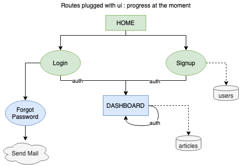

# The Weekly Edge Application

This repository is for development of TWE Web Application for The Hindu Education Plus Club. 

## Flow

Progress tested with basic ui for now

## Progress

1. Routes for basic user operations set up - Login, Register, Signup, Update, Delete, logout, logout everywhere, forgot password.
2. Routes for handling articles set up - create, update, list by id, list all, delete
3. basic frontend with hbs dynamic rendering
4. validation using validator during db storage
5. auth middleware - checks for jwt token during login/signup and stored browser cookie.
6. picture upload for each article

&copy;
Copyright of The Hindu Education Plus Club VIT Vellore